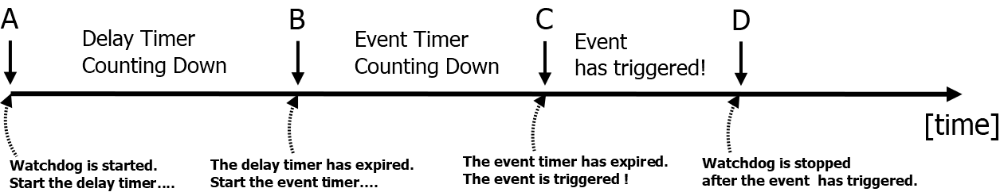
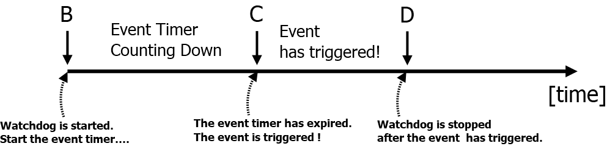

# eio-sample
## Introduction
The EIO is an embedded controller by Advantech.

The eio-sample shows how to access an embedded controller for getting hardware monitor data or using function implemented by EC.

## Application

| apps | Function |
| ---- | --------- |
|caseopen| Showing caseopen status |
|curr| Showing current data |
|ecram| Showing ACPI EC RAM data |
|fan| Showing fan data |
|gpio| Getting/Setting General Purpose I/O Pin |
|panel| Showing panel status (back-light etc.) |
|pwm| Showing PWM status |
|storage| Getting/Setting storage |
|tach| Showing tachometer status |
|therm| Showing thermal data |
|ver| Showing version information |
|volt| Showing voltage data |
|wdt| Getting/Setting watchdog |

## Watchdog
### Watchdog with delay

### Watchdog without delay

